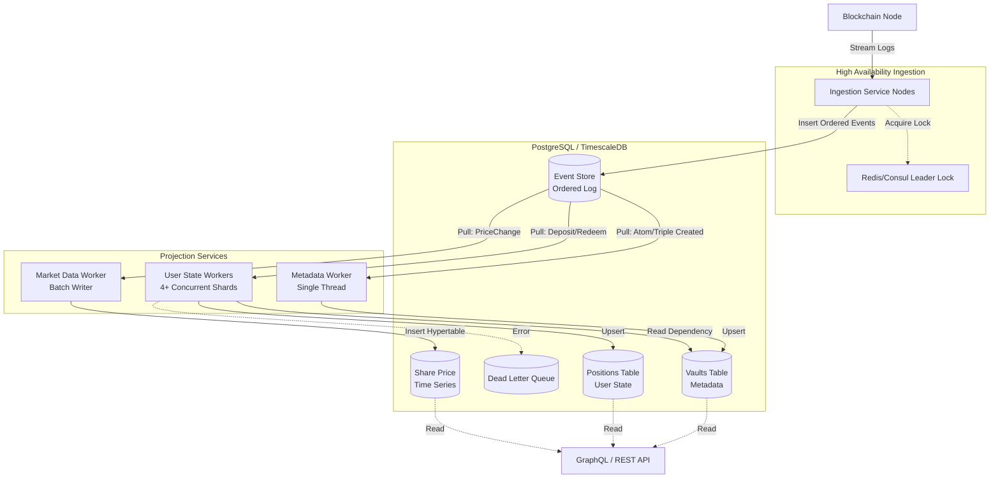
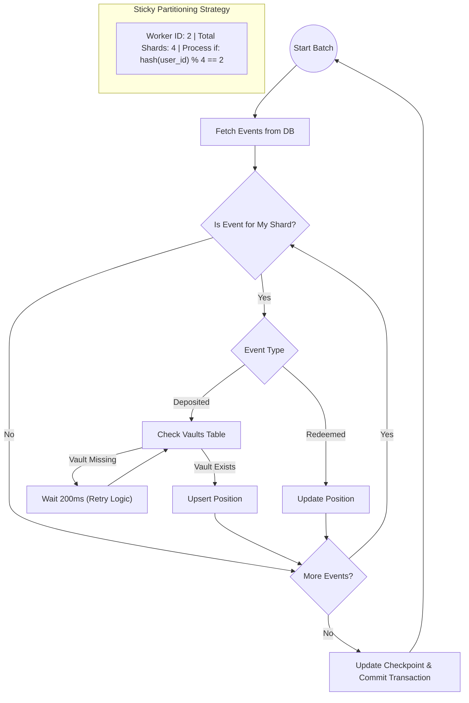
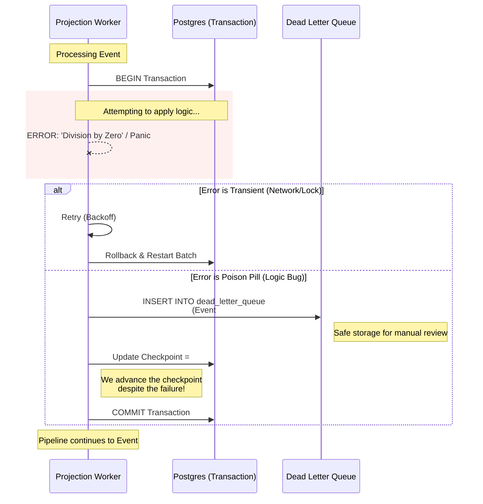

This is a formal **System Architecture Specification**. It is written to be directly consumable by Senior Software Engineers and AI coding assistants. It addresses the scale of **300k vaults** and **4M positions**, the specific event ordering of your custom chain, and the strict reliability requirements.

# System Architecture Specification: High-Scale Blockchain Event Processing

**Version:** 3.0 (Production-Ready)
**Target Scale:** 300k Vaults, 4M+ Positions, 300+ EPS (Peak)
**Stack:** Rust, PostgreSQL (TimescaleDB), Kubernetes

-----

## 1\. Executive Summary

This system implements an **Event Sourcing** architecture to process blockchain events from a single high-throughput contract. It prioritizes data integrity and query performance over immediate write consistency.

**Key Design Decisions:**

  * **Write Model:** A single, ordered append-only `event_store` acts as the Source of Truth.
  * **Read Model:** Three decoupled projection streams (Metadata, User State, Market Data) transform events into optimized query tables.
  * **Concurrency:** User state is processed in parallel using **Sticky Partitioning** (sharding by User ID) to handle the 4M+ position scale.
  * **Reliability:** Dependencies between streams (e.g., Vault creation vs. Deposit) are handled via **Optimistic Retries** rather than rigid locking.

-----

## 2\. Infrastructure & Capacity Planning

Based on the provided constraints (8 vCPU, 32GB RAM, 100GB Storage), the following resource allocation is defined:

  * **Database (TimescaleDB)**:
      * **Memory:** allocate 12GB to `shared_buffers` (Postgres) and OS cache.
      * **Storage:** 100GB is tight for uncompressed event sourcing. **Compression is mandatory** (see Section 3.3).
      * **CPU:** 4 Cores reserved for DB queries/indexing.
  * **Ingestion Service**:
      * **Replicas:** 2 (Active-Passive).
      * **Resources:** Very low (0.5 CPU, 512MB RAM).
  * **Projection Services**:
      * **Metadata Service:** 1 Instance (0.5 CPU).
      * **Market Data Service:** 1 Instance (1 CPU).
      * **User State Service:** 4 Concurrent Workers (0.5 CPU each).

-----

## 3\. Database Schema (The Source of Truth)

All tables exist within the same TimescaleDB instance.

### 3.1 The Event Store

Optimized for the "Single Contract" scenario. We use a **global sequence** (`BIGSERIAL`) because the event rate (300/s) is well within Postgres write limits (10k+/s).

```sql
CREATE TABLE event_store (
    sequence_number BIGSERIAL NOT NULL, -- Global ordering
    
    -- Blockchain Identifiers
    block_number BIGINT NOT NULL,
    block_timestamp TIMESTAMPTZ NOT NULL,
    transaction_hash TEXT NOT NULL,
    log_index INTEGER NOT NULL,
    
    -- Domain Data
    event_type TEXT NOT NULL, -- 'AtomCreated', 'Deposited', 'SharePriceChanged', etc.
    event_data JSONB NOT NULL, -- Full payload
    
    -- Partitioning Keys (Extracted for Indexing)
    -- "term_id" maps to Vault Address/ID
    term_id TEXT GENERATED ALWAYS AS (event_data->>'term_id') STORED,
    
    -- "entity_id" maps to the User Address (for Deposited/Redeemed) or Atom ID
    entity_id TEXT GENERATED ALWAYS AS (
        CASE 
            WHEN event_type IN ('Deposited', 'AtomCreated') THEN event_data->>'receiver'
            WHEN event_type = 'Redeemed' THEN event_data->>'sender'
            ELSE NULL 
        END
    ) STORED,

    -- Reliability
    ingested_at TIMESTAMPTZ DEFAULT NOW(),
    
    PRIMARY KEY (block_timestamp, sequence_number),
    UNIQUE (transaction_hash, log_index)
);

-- Turn into Hypertable (Chunk by 1 week)
SELECT create_hypertable('event_store', 'block_timestamp', chunk_time_interval => INTERVAL '1 week');

-- Indexes
CREATE INDEX idx_event_sequence ON event_store (sequence_number); -- For Projections
CREATE INDEX idx_event_term_id ON event_store (term_id, block_timestamp); -- For debugging specific vaults
```

### 3.2 Dead Letter Queue (DLQ)

Used to isolate poison pills without stopping the pipeline.

```sql
CREATE TABLE dead_letter_queue (
    event_sequence BIGINT PRIMARY KEY,
    projection_name TEXT NOT NULL,
    error_message TEXT NOT NULL,
    retry_count INT DEFAULT 0,
    status TEXT DEFAULT 'OPEN', -- OPEN, RESOLVED
    created_at TIMESTAMPTZ DEFAULT NOW()
);
```

### 3.3 Compression Policy (Critical for 100GB Limit)

We must compress old events to save space. JSONB compresses extremely well (90%+).

```sql
ALTER TABLE event_store SET (
    timescaledb.compress,
    timescaledb.compress_segmentby = 'event_type', 
    timescaledb.compress_orderby = 'block_timestamp, sequence_number'
);

-- Compress chunks older than 1 month
SELECT add_compression_policy('event_store', INTERVAL '1 month');
```

-----

## 4\. Ingestion Service (The Writer)

**Responsibility:** Fetch logs, parse, and write to `event_store`.
**Ordering:** Strict. Must respect `block_number` ASC, `log_index` ASC.

### 4.1 High Availability Pattern

Since we have a single contract stream, we use a **Leader Election** pattern.

```rust
// Pseudo-code for Leader Election
async fn run_ingestion_loop() {
    let lease_key = "ingestion_leader_lock";
    
    loop {
        // 1. Try to acquire lease (TTL 15s)
        if redis.set_nx(lease_key, my_instance_id, ttl=15).await? {
            // I am leader
            spawn_keepalive_heartbeat();
            
            let last_block = db.get_max_block_number().await?;
            ingest_from(last_block + 1).await?;
        } else {
            // I am follower
            sleep(5000).await;
        }
    }
}
```

-----

## 5\. Projection Services (The Readers)

We split processing into three distinct services to handle the different data shapes and dependencies.

### 5.1 Metadata Projection (The Registry)

  * **Events:** `AtomCreated`, `TripleCreated`, `Initialized`.
  * **Target Table:** `vaults` (or `atoms`).
  * **Concurrency:** Single-Threaded (Sequence-based).
  * **Priority:** Critical. Must run as fast as possible to prevent "Missing Foreign Key" errors in other streams.

<!-- end list -->

```sql
CREATE TABLE vaults (
    term_id TEXT PRIMARY KEY,
    vault_type TEXT NOT NULL, -- 'Atom', 'Triple'
    created_at_block BIGINT NOT NULL,
    metadata JSONB
);
```

### 5.2 Market Data Projection (Time Series)

  * **Events:** `SharePriceChanged`.
  * **Target Table:** `share_price_history`.
  * **Concurrency:** Single Batch Writer.
  * **Logic:** Since `SharePriceChanged` emits *before* the deposit in the same block, we simply record it. The timestamp is the block timestamp.

<!-- end list -->

```sql
CREATE TABLE share_price_history (
    time TIMESTAMPTZ NOT NULL,
    term_id TEXT NOT NULL,
    share_price NUMERIC NOT NULL,
    total_assets NUMERIC NOT NULL,
    
    -- Optimize storage: We partition by time
    PRIMARY KEY (time, term_id)
);

SELECT create_hypertable('share_price_history', 'time');
```

### 5.3 User State Projection (The Heavy Lifter)

  * **Events:** `Deposited`, `Redeemed`.
  * **Target Tables:** `positions` (Current Balance), `vault_stats` (Aggregates).
  * **Scale:** 4M+ rows.
  * **Concurrency:** **Sharded Parallelism**.

#### Sharding Strategy: "Sticky Partitioning"

We run **N** workers (e.g., 4).
Worker `K` processes events where `hash(user_address) % N == K`.

**Handling the Dependency (The "AtomCreated" Race):**
Since `AtomCreated` and `Deposited` happen in the same transaction, and `AtomCreated` is logically first, they are written to `event_store` in that order.
However, because the **Metadata Projection** and **User Projection** are separate processes, the User Worker might try to process the `Deposited` event *before* the Metadata Worker has inserted the `vault` row.

**The Solution: `RetryPolicy`**

```rust
// crates/projections/src/user_worker.rs

async fn handle_deposit(&self, tx: &mut Tx, event: &Event) -> Result<()> {
    let term_id = event.data["term_id"].as_str().unwrap();
    let user_id = event.data["receiver"].as_str().unwrap();

    // 1. Check if Vault exists (Dependency Check)
    // We check the 'vaults' table managed by Metadata Projection
    let vault_exists = sqlx::query!("SELECT 1 FROM vaults WHERE term_id = $1", term_id)
        .fetch_optional(&mut *tx)
        .await?;

    if vault_exists.is_none() {
        // DEPENDENCY MISSING
        // Since we know they are in the same block, the Metadata service 
        // is just milliseconds behind.
        
        // Option A: Throw error to trigger the Framework's backoff
        return Err(anyhow::anyhow!("DEPENDENCY_MISSING: Vault {}", term_id));
        
        // Option B (Better): Internal micro-sleep and retry once
        tokio::time::sleep(Duration::from_millis(200)).await;
        // Check again... if still missing, return Err.
    }

    // 2. Upsert Position
    sqlx::query!(
        "INSERT INTO positions (user_id, term_id, shares) VALUES ($1, $2, $3)
         ON CONFLICT (user_id, term_id) DO UPDATE SET shares = positions.shares + $3",
        user_id, term_id, event.data["shares"]
    )
    .execute(&mut *tx)
    .await?;

    Ok(())
}
```

-----

## High-Level Data Flow



## User State Projection: Sharding & Dependency Logic



## Reliability & Fault Tolerance (DLQ Flow)



## 6\. Implementation Guide: The Projection Framework

All projections use this common Rust logic to handle Checkpoints and DLQs.

```rust
// crates/projections/src/lib.rs

pub struct ProjectionWorker {
    name: String,
    shard_id: u32,
    total_shards: u32,
}

impl ProjectionWorker {
    pub async fn run(&self) -> Result<()> {
        loop {
            // 1. Read Checkpoint
            let last_seq = db.get_checkpoint(&self.name).await?;

            // 2. Fetch Batch (Batch Size = 500)
            // FILTER: Only fetch events relevant to this Shard!
            // This prevents fetching 90% useless data.
            let events = db.fetch_events_for_shard(
                last_seq, 
                500, 
                self.shard_id, 
                self.total_shards
            ).await?;

            if events.is_empty() {
                sleep(100ms).await;
                continue;
            }

            // 3. Process Batch
            let mut tx = db.begin().await?;
            for event in events {
                match self.apply(&mut tx, &event).await {
                    Ok(_) => {},
                    Err(e) => {
                         if e.to_string().contains("DEPENDENCY_MISSING") {
                             // Rollback and retry the whole batch after delay
                             // Do NOT DLQ this. It will resolve itself.
                             tx.rollback().await?;
                             sleep(500ms).await;
                             break; // Break inner loop, restart batch
                         } else {
                             // Poison Pill -> DLQ
                             self.send_to_dlq(&mut tx, event, e).await?;
                         }
                    }
                }
            }

            // 4. Update Checkpoint
            // If we broke early due to dependency, this won't run.
            self.update_checkpoint(&mut tx, events.last().unwrap().seq).await?;
            tx.commit().await?;
        }
    }
}
```

-----

## 7\. Handling Reorgs

Since this is a custom chain, we assume standard finality rules.

**Strategy:** Snapshotting + Rollback.
Because we have 4M positions, we cannot "rebuild from genesis."

1.  **Snapshots:** Every 10,000 blocks, the system exports a CSV of the `positions` table to S3/Disk.
2.  **On Reorg:**
      * Detect Reorg at Block `N`.
      * Restore DB from Snapshot `Sequence < N`.
      * Restart Projections from Snapshot Sequence.

*Note: For smaller reorgs (\<100 blocks), it is acceptable to just pause ingestion and let the chain stabilize, or use the "Mark Non-Canonical" strategy described in previous iterations if specific row-level undo logic is implemented.*

## 8\. Migration & Deployment

1.  **Bootstrap:**
      * Deploy TimescaleDB.
      * Enable Compression Policies immediately.
2.  **Backfill:**
      * Start Ingestion Service (Fill `event_store`).
      * Start **Metadata Projection** (Fill `vaults`). Wait for completion.
      * Start **User & Market Projections** (Fill `positions` and `prices`).
3.  **Production:**
      * Enable User Sharding (4 replicas).
      * Monitor `dead_letter_queue` closely.